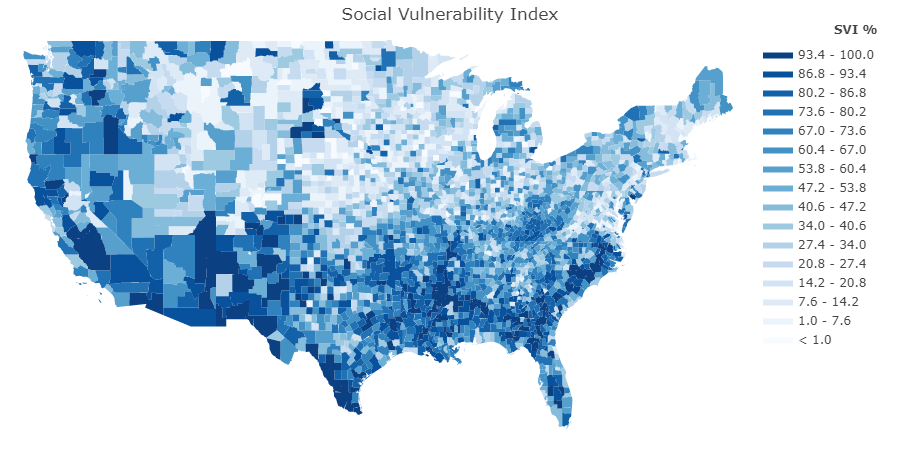

# COVID – 19 Vaccine Consumption

By: Shuya Chen, John Liu, Chris Sokolowski

## Background 

COVID-19 is a disease caused by a virus named SARS-CoV-2 and was discovered in December 2019 in Wuhan, China. It is highly contagious and has quickly spread around the world ([source](https://www.fda.gov/news-events/press-announcements/fda-approves-first-covid-19-vaccine)). On December 11, 2020, the FDA issued an Emergency Use Authorization (EUA) for the use of the Pfizer-BioNTech COVID-19 Vaccine. On December 18, 2020, the FDA issued an EUA for the use of the Moderna COVID-19 Vaccine. And on February 27, 2021 the FDA issued an EUA for the use of the Janssen COVID-19 Vaccine. It was not until August 23, 2021, the FDA approved the first COVID-19 vaccine, known as the Pfizer-BioNTech COVID-19 Vaccine, now known as Comirnaty ([source](https://www.fda.gov/news-events/press-announcements/fda-approves-first-covid-19-vaccine)). Vaccine hesitancy has been identified as a leading global health treat. The top four reasons for vaccine hesitancy are: 1. Safety and efficacy concerns 2. Preference for physiological immunity 3. Distrust in government and health organizations 4. Autonomy and personal freedom ([source](https://www.aafp.org/journals/fpm/blogs/inpractice/entry/countering_vaccine_hesitancy.html)). 

## Problem Statement 

For this project we want to estimate state vaccine consumption with vaccine hesitancy with the goal of creating more efficient vaccine allocations.

Who are we doing this for?
- common public: more efficiently allocated vaccines means more people who want it can get it
- government: less wasted resources
- medical companies: less wasted vaccines

Our success metric is RMSE

## Datasets 

Three datasets were exported from CDC:
- COVID-19 Vaccinations in the United States, County ([link](https://data.cdc.gov/Vaccinations/COVID-19-Vaccinations-in-the-United-States-County/8xkx-amqh))
- COVID-19 Vaccinations in the United States, Jurisdiction ([link](https://data.cdc.gov/Vaccinations/COVID-19-Vaccinations-in-the-United-States-Jurisdi/unsk-b7fc))
- COVID-19 County Hesitancy ([link](https://data.cdc.gov/Vaccinations/COVID-19-County-Hesitancy/c4bi-8ytd))

## Data Dictionary

Full data dictionary can be obtained here:
- [COVID-19 Vaccinations in the United States, County](https://data.cdc.gov/Vaccinations/COVID-19-Vaccinations-in-the-United-States-County/8xkx-amqh)
- [COVID-19 Vaccinations in the United States, Jurisdiction](https://data.cdc.gov/Vaccinations/COVID-19-Vaccinations-in-the-United-States-Jurisdi/unsk-b7fc)
- [COVID-19 County Hesitancy](https://data.cdc.gov/Vaccinations/Vaccine-Hesitancy-for-COVID-19-County-and-local-es/q9mh-h2tw)

## EDA

### County Choropleth Maps

Most counties showing up. Vaccine percentage per county about what I expected, with Georgia clearly behind other states.

A few more counties not recording who only has received one dose, mostly in rural Nebraska. Data maps well onto total vaccinated numbers, with no weird outliers way ahead on the first dose, but lagging on the second dose.

Interestingly, the only map with clear state lines across the whole map. This fact means that either: vaccine hesitancy is heavily informed by state culture rather than county, or states are using different metrics to determine vaccine hesitancy. Or a mix of both. Vaccine hestiancy higher in southern states and the northern Rockies.

Looking at how badly counties might be affected by a COVID outbreak. Mostly the southern states as well as California and the Pacific Northwest.

Looking at how worried the CVAC is worried about the ability to distribute vaccines across counties. Maps fairly closely to SVI index, with exceptions of more rollout concern for Missouri and Indiana, and less concern about Kentucky.

### Most and Least Vaccinated Counties

No real pattern for most vaccinated counties. Counties coming from the whole of the US.

To no surprise from earlier visualization, Georgian counties among the most on the chart, with surprisingly some Massachusettes counties.

### Most Hesitant Counties vs Vaccination Rate

All Montana counties showing up as they are the least dense state, and people might not feel the vaccine is necessary as they are having little contact with others.

Despite similar hesitancy rates, massive variance in vaccination rates.

### Least Hesitant Counties vs Vaccination Rate

Around a 3% hesitancy rate for the lowest. Counties found mostly in the Northeast and California.

More consistently higher vaccination rates as compared to the most hesitant counties. However, still a good deal of variance.

### Vaccine Distribution over Time from State Sampling

Although our model will not be factoring time, I still want to take a glance of distribution to see if there are any useful patterns to inform ourselves.

All states follow same curve over time. Florida and New York have almost identical population and have almost the same plot. When scaling population numbers for states, all follow almost the identical line. It is safe to say that state distribution is determined almost solely by population. Hopefully our model can distribute vaccines in a more efficient manner as not all states will use their allocated vaccines and will go to waste.

## Analysis Summary 

## Conclusion 

## Acknowledgements 

